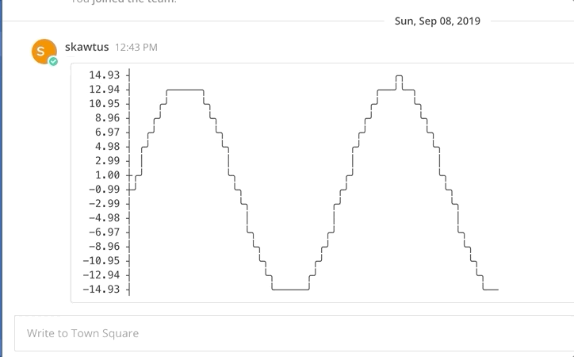

# Mattermost Plugin Ascii Plot
   [](https://codecov.io/gh/scottleedavis/mattermost-plugin-ascii-plot)  [](https://github.com/scottleedavis/mattermost-plugin-ascii-plot/releases/latest)

Modifies a post with plot data and generates a simple ascii plot using [asciigraph](https://github.com/guptarohit/asciigraph)



Usage (start a message in mattermost with `asciiplot` or `asciigraph`, followed by a space and a list of numbers seperated by commas)
```bash
asciiplot 3, 4, 9, 6, 2, 4, 5, 8, 5, 10, 2, 7, 2, 5, 6
```
Build
```
make
```

This will produce a single plugin file (with support for multiple architectures) for upload to your Mattermost server:

```
dist/com.github.scottleedavis.mattermost-plugin-ascii-post.tar.gz
```
